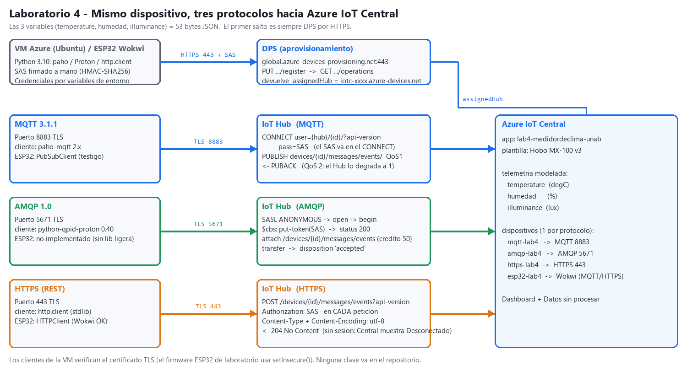

# Laboratorio 4 — AMQP + tercer protocolo (HTTPS)
### Comparación con MQTT hacia Azure IoT Central

**Materia:** IoT + Cloud + Sistemas Distribuidos — Universidad Autónoma de Bucaramanga (UNAB)
**Escenario:** UNAB-Ambiental · plantilla `Hobo MX-100 v3` · 3 variables: `temperature`, `humedad`, `illuminance`
**Repositorio:** <https://github.com/Daniverd15/Laboratorio-4>

Este laboratorio cambia el **transporte** del dispositivo sin cambiar la aplicación: las mismas 3 variables
llegan a la misma app de IoT Central por **MQTT** (línea base del Lab 3), por **AMQP 1.0** (Etapa 1) y por
**HTTPS/REST** (Etapa 2, tercer protocolo). Después se miden, se comparan y se recomienda qué usar en cada capa.

> **Nota sobre la infraestructura.** La suscripción de Azure de los Labs 1–3 se quedó sin créditos, así que para este
> laboratorio se **recreó todo** en una suscripción nueva (*Azure for Students*): app de IoT Central
> `lab4-medidordeclima-unab`, plantilla `Hobo MX-100 v3` (misma telemetría y comando `setAlertLed`), una VM Ubuntu
> (`vm-lab4-iot`, B2ats_v2, North Central US) y los dispositivos. El cliente MQTT del Lab 3 se reutiliza como línea base.

## 1. Resultados en una tabla

| Camino | Puerto | Bytes en el cable por mensaje¹ | ACK p50 / p95 | Abrir conexión + 1 mensaje | Estado en Central |
|---|---|---|---|---|---|
| MQTT 3.1.1 QoS 1 (paho) | 8883 | **365 B** (6,9×) | 103 / 118 ms | 6,2 KB · 45 ms | Conectado |
| **AMQP 1.0** (Proton) | 5671 | **438 B** (8,3×) | 103 / 111 ms | 9,2 KB · 100 ms | Conectado |
| **HTTPS REST** keep-alive | 443 | **901 B** (17×) | 109 / 115 ms | 5,7 KB · 41 ms | **Desconectado**² |
| HTTPS sin keep-alive | 443 | 5 699 B (107×) | 199 / 236 ms | 5,7 KB | Desconectado² |

¹ Payload de 53 B (JSON con las 3 variables). Bytes IP totales (cabeceras IP+TCP, TLS, protocolo, ACKs) medidos con contadores `iptables`.
² HTTPS no mantiene sesión: la telemetría llega a Central (captura `13`), pero el dispositivo se ve siempre *Desconectado*.

## 2. Estructura del repositorio

```
laboratorio4/
├── README.md                      (este archivo)
├── Informe_Laboratorio4.pdf/.docx (informe de 2 páginas)
├── requirements.txt  .env.example (dependencias; plantilla de variables SIN claves)
├── common/
│   ├── iotc_common.py             SAS a mano, DPS por HTTPS, 3 variables, Productor con cola, Medidor (latencias/CSV)
│   └── sas_cli.py                 imprime un SAS (para depurar con curl)
├── amqp/amqp_iothub.py            ← ETAPA 1: AMQP 1.0 (Proton) con CBS, enlaces, crédito y renovación del SAS
├── https/https_telemetria.py      ← ETAPA 2: tercer protocolo, HTTPS/REST (stdlib)
├── mqtt/mqtt_baseline.py          MQTT explícito (paho) del Lab 3, medido igual que los otros; opción MQTT-WS 443
├── systemd/lab4-*.service         los 3 clientes como servicios en la VM
├── wokwi/
│   ├── esp32-mqtt/                testigo MQTT en ESP32 (firmware del Lab 2/3, credenciales por -D)
│   ├── esp32-https/               HTTPS en ESP32: DPS por REST + POST de telemetría (HTTPClient)
│   └── build_y_simular.sh         compila con PlatformIO y simula con wokwi-cli (sin navegador)
├── medicion/                      bench_bytes.sh · corte_red.sh · *_resumen.py · render_evidencias.py · diagrama.py
├── mediciones/                    logs y CSV REALES de todas las corridas
└── evidencias/                    capturas de IoT Central / Azure + logs renderizados + diagrama
```

## 3. Arquitectura



Todos los caminos empiezan igual: **DPS por HTTPS** (`PUT …/register` + `GET …/operations`) devuelve el IoT Hub asignado.
Luego cada cliente habla su protocolo con ese Hub. El token **SAS se firma a mano** en los tres (sección 5).

## 4. Cómo reproducirlo

Requisitos: Python 3.9+, una app de IoT Central con la plantilla de telemetría y un dispositivo por protocolo.
(La app y los dispositivos se crearon por la API REST de IoT Central; también se pueden crear desde la interfaz.)

```bash
python3 -m venv .venv && source .venv/bin/activate
pip install paho-mqtt                       # MQTT
# AMQP en LINUX: el wheel de PyPI de python-qpid-proton NO incluye TLS (falla con "SSL failure").
sudo apt install build-essential cmake libssl-dev libsasl2-dev python3-dev swig pkg-config
pip install --no-binary python-qpid-proton python-qpid-proton    # compila contra OpenSSL
# (en Windows el wheel usa Schannel y funciona directamente)

mkdir env && cp .env.example env/amqp.env        # completa IOTC_ID_SCOPE / IOTC_DEVICE_ID / IOTC_DEVICE_KEY
set -a; . env/amqp.env; set +a
IOTC_N=5 IOTC_SEND_INTERVAL=2 python amqp/amqp_iothub.py          # 5 mensajes por AMQP
PN_TRACE_FRM=1 IOTC_N=3 python amqp/amqp_iothub.py                # + tramas AMQP crudas
IOTC_N=5 python https/https_telemetria.py                          # HTTPS
IOTC_N=5 IOTC_QOS=1 python mqtt/mqtt_baseline.py                   # MQTT (IOTC_MQTT_TRANSPORT=websockets → 443)
```

Mediciones (en la VM, con `sudo` para `iptables`): `medicion/bench_bytes.sh` (bytes + latencias),
`MODO=reset|drop medicion/corte_red.sh` (corte de 16 s), y `python3 medicion/*_resumen.py` para las tablas.
Servicios: `sudo cp systemd/lab4-*.service /etc/systemd/system/ && sudo systemctl enable --now lab4-amqp lab4-mqtt lab4-https`
(los tres corrieron ≈ 35 min seguidos enviando cada 5 s: `mediciones/log_servicios_vm.txt`; en AMQP el crédito del enlace se repone solo, ver `credito_restante`).

## 5. Credenciales y SAS — sin secretos en el repo

Las claves se leen de **variables de entorno** (`IOTC_DEVICE_KEY`…); `env/` y `*.env` están en `.gitignore`. Si una clave se expone, se
regenera en IoT Central. El SAS lo construye `generar_sas()` en `common/iotc_common.py`:

```
encoded = urlencode(recurso)                      recurso = "<hub>/devices/<id>"  |  "<idScope>/registrations/<id>"
firma   = base64( HMAC-SHA256( base64decode(CLAVE), encoded + "\n" + expiración ) )
SAS     = "SharedAccessSignature sr=" + encoded + "&sig=" + urlencode(firma) + "&se=" + expiración [+ "&skn=registration"]
```

Dónde viaja el mismo SAS en cada protocolo: **MQTT** → campo *password* del CONNECT · **AMQP** → mensaje `put-token` al nodo `$cbs`
· **HTTPS** → cabecera `Authorization` de **cada** petición.

## 6. Etapa 1 — AMQP hacia IoT Central

`amqp/amqp_iothub.py` (Apache Qpid **Proton** 0.40). Lo que hace, y que un SDK ocultaría:

1. **TLS 5671 verificado + SASL ANONYMOUS** → `open` → `begin` (sesión). El Hub anuncia `PLAIN, ANONYMOUS, MSSBCBS, EXTERNAL`.
2. **CBS (Claims-Based Security):** enlaces `sender`/`receiver` al nodo `$cbs`; se envía `put-token` (`type=servicebus.windows.net:sastoken`,
   `name=<hub>/devices/<id>`) y el Hub responde `status-code=200`.
3. **Enlace de telemetría** `/devices/<id>/messages/events`; el Hub concede **crédito** (50) y el cliente solo envía si hay crédito.
4. Cada lectura = 1 `transfer` (propiedades `application/json` + `utf-8`, cuerpo `data`); el Hub responde `disposition accepted` (ack).
5. **Renovación del SAS sin reconectar:** un segundo `put-token` por la misma conexión.

| Dato | Valor |
|---|---|
| Puerto / TLS | 5671 / TLS verificado (cadena + nombre) |
| ¿Aparece en Data explorer / datos sin procesar? | **Sí** — ver `evidencias/12-central-amqp-datos-sin-procesar.jpg` (JSON con las 3 variables), el dashboard `16` y el **Explorador de datos** `18` |
| Establecimiento | TCP+TLS+SASL+Open ≈ 80–140 ms, `put-token` ≈ 10 ms |
| Qué cambia respecto a MQTT | sesión + enlaces + crédito (flujo controlado), ack por mensaje (`accepted/rejected/released`), SAS renovable en caliente, depuración por tramas |

**Modo alternativo sin CBS** (`IOTC_AMQP_AUTH=plain`, `mediciones/log_amqp_sasl_plain.txt`): SASL PLAIN con usuario `<id>@sas.<hub>` y el SAS como clave; también funciona y queda listo para enviar en ≈123 ms (un viaje menos que con CBS), pero **pierde la renovación del SAS en banda**.

**¿Cómo se demuestra que fue AMQP y no otro transporte?** (1) el dispositivo `amqp-lab4` solo lo usa `amqp/amqp_iothub.py`; (2) el log muestra `amqps://<hub>:5671` y las tramas reales `open/begin/attach/flow/transfer/disposition` (`evidencias/02`, `02b`); (3) en el benchmark los contadores `iptables` de la corrida `amqp` suman tráfico **solo en el puerto 5671** (`mediciones/bytes.csv`); (4) Central recibe esas lecturas en el dispositivo `AMQP 5671` (`evidencias/12`).

**¿Qué problema resuelve AMQP mejor que MQTT?** (a) *Control de flujo* por crédito: el receptor decide cuánto recibe (contrapresión);
(b) *liquidación explícita* por mensaje con tres resultados; (c) *seguridad en banda*: el token se renueva sin tirar la conexión
(experimento: SAS de 120 s, 3 renovaciones en 330 s, **0 reconexiones**, `evidencias/07`); (d) es el protocolo nativo del plano de
servicio de Azure (Service Bus, Event Hubs). Lo que **no** gana: latencia ni bytes (ver sección 8).

Hallazgos de implementación reales: el SDK `azure-iot-device` de **Python no tiene AMQP** (`evidencias/08`: 0 archivos mencionan *amqp*; su
único `websockets` es MQTT-sobre-WS) → se usa un cliente AMQP 1.0 genérico; el wheel de Proton para Linux **no trae TLS** (hay que compilarlo);
Proton entrega un objeto Python nuevo por evento, así que los enlaces se comparan por **nombre**, no por identidad.

## 7. Etapa 2 — Tercer protocolo: HTTPS (REST)

**Justificación de negocio (una línea):** un sensor de batería que despierta cada pocos minutos, manda una lectura y se duerme paga
más por mantener una sesión que por una petición, y HTTPS (443) atraviesa los firewalls/proxys corporativos del cliente sin abrir puertos.

`https/https_telemetria.py` (solo librería estándar): `POST https://<hub>/devices/<id>/messages/events?api-version=2021-04-12`
con `Authorization: <SAS>`, `Content-Type: application/json` y **`Content-Encoding: utf-8`** → `204 No Content`.
Descubrimiento: sin `Content-Encoding` el Hub acepta el POST (204) pero **IoT Central no interpreta el JSON** (no aparece telemetría);
con él, sí. Depuración con `curl`: `evidencias/11-https-curl-debug.png` (204 válido / 401 `IotHubUnauthorizedAccess` con firma alterada).

| Ventajas | Desventajas (medidas o de documentación†) |
|---|---|
| Sin librería ni broker; 117 líneas; depurable con `curl`/navegador | 901 B por mensaje (17×); sin keep-alive 5,7 KB y 199 ms por mensaje |
| 443 pasa casi cualquier firewall/proxy | El SAS viaja en **cada** petición |
| Códigos de estado estándar (204, 401…) | Central lo muestra **Desconectado** siempre; sin presencia |
| Funciona en el ESP32 (Wokwi) | Sin comandos hacia el dispositivo† (tendría que sondear mensajes C2D) |

**En el microcontrolador (Wokwi):** `wokwi/esp32-https` hace DPS por REST y POST de telemetría con `HTTPClient`: primer POST ≈ 4,0 s (handshake TLS
en el ESP32 simulado), siguientes ≈ 162 ms (`evidencias/09`). El testigo MQTT (`wokwi/esp32-mqtt`): `TCP+TLS+CONNECT` ≈ 3,8 s (`evidencias/10`).
Ambos llegan a Central (`evidencias/15`). Simplificación de laboratorio: el firmware usa `setInsecure()` (no valida el certificado); en producción, `setCACert()`.

## 8. Mediciones y rigor

Todas las cifras salen de `mediciones/` (logs y CSV reales). VM `Standard_B2ats_v2` en North Central US → IoT Hub de la app.

**Bytes y latencia** (N=51 mensajes a 1 msg/s; bytes/mensaje = (B₅₁ − B₁)/50; contadores `iptables` por puerto):

| Protocolo | Setup hasta enviar | ACK p50 | ACK p95 | Bytes/msg | Conexión + 1 msg | Paquetes/msg |
|---|---|---|---|---|---|---|
| MQTT 8883 QoS 1 | 45 ms | 103 ms | 118 ms | 365 | 6 180 | 4,0 |
| MQTT 8883 QoS 0 | 50 ms | — (sin ack) | — | 221 | 6 129 | 1,9 |
| MQTT-WS 443 QoS 1 | 166 ms | 105 ms | 113 ms | 370 | 11 922 | 4,0 |
| AMQP 5671 | 100 ms | 103 ms | 111 ms | 438 | 9 162 | 4,2 |
| HTTPS 443 keep-alive | 41 ms | 109 ms | 115 ms | 901 | 5 730 | 5,0 |
| HTTPS 443 sin keep-alive | 35 ms | 199 ms | 236 ms | 5 699 | 5 691 | 16,1 |

La latencia **no distingue** a MQTT, AMQP y HTTPS con keep-alive: el ack de telemetría tarda ≈ 100 ms en los tres mientras que un `put-token` AMQP
se contesta en ≈ 10 ms, lo que indica que domina el procesamiento del Hub al persistir el mensaje (inferencia, no medida directamente). Lo que sí cambia son
los bytes, el costo de abrir la conexión y la robustez.

**Corte de red de 16 s** (40 mensajes, 1/s; `iptables` en la VM; backoff máx. 2 s en los tres clientes):

| Modo | Protocolo | Perdidos | Reenvíos | Reconexiones | Red vuelve → 1.er ACK | Espera máx. |
|---|---|---|---|---|---|---|
| reset (RST de firewall) | MQTT QoS 1 | 0 | 0 | 1 | 1,5 s | 17,3 s |
| reset | AMQP | 0 | **1** (posible duplicado) | 1 | 1,6 s | 17,5 s |
| reset | HTTPS keep-alive | 0 | 0 | 1 | 1,3 s | 17,3 s |
| drop (agujero negro) | MQTT QoS 1 | 0 | 0 | **0** (TCP retransmite) | 0,3 s | 16,1 s |
| drop | AMQP | 0 | 0 | **0** | 0,2 s | 16,1 s |
| drop | HTTPS keep-alive | 0 | 0 | 1 (timeout de 20 s del cliente) | 5,3 s | 21,3 s |

Los tres recuperan todo (cola en memoria del cliente, *al menos una vez*): la diferencia es **quién** hace la cola — paho en MQTT QoS 1,
el código de la aplicación en AMQP y HTTPS. Con AMQP hay que deduplicar por `message-id` (hubo un reenvío).
(Con un backoff de 16 s la recuperación sube a ≈ 31 s en los tres: `mediciones/prueba_backoff16/`.)

**Renovación del SAS** (TTL 120 s, 330 s de ejecución): AMQP renovó 3 veces dentro de la conexión; en MQTT el SAS solo existe en el CONNECT
(renovar = reconectar con un token nuevo). En esos 330 s el Hub **no** cortó la conexión MQTT con el token ya vencido (la verificación en
conexiones abiertas es perezosa); no debe confiarse en eso.

## 9. Tabla comparativa (†: de la documentación, no medido aquí)

| Criterio | MQTT (8883) | AMQP 1.0 (5671) | HTTPS (443) |
|---|---|---|---|
| Overhead por mensaje (53 B de payload) | **365 B** (QoS 0: 221) | 438 B | 901 B (sin keep-alive 5 699) |
| Latencia percibida (ACK p50) | 103 ms | 103 ms | 109 ms (199 sin keep-alive) |
| Fiabilidad | QoS 0/1 (QoS 2 se degrada a 1, Lab 3); paho reencola solo | `accepted/rejected/released` por mensaje; reenvío por la app | Solo lo que programe la app (cola + reintentos + timeouts) |
| Renovar el SAS | Reconectar | **En caliente (CBS)** | Nuevo SAS en cada petición |
| Microcontrolador / Wokwi | **Probado** (PubSubClient; handshake 3,8 s) | No implementado: sin cliente ligero estándar para Arduino-ESP32 (el SDK C de Azure lo soporta, pero es pesado†) | **Probado** (HTTPClient; 4,0 s + 162 ms) |
| Facilidad de debug | Media (`IOTC_DEBUG` = paquetes crudos) | Baja–media (`PN_TRACE_FRM`, estructuras + payload binario) | **Alta** (`curl -i`, códigos estándar) |
| Firewalls | 8883 a menudo bloqueado → **MQTT-WS 443 probado** (370 B/msg, +5,7 KB de setup) | 5671; AMQP-WS 443† (Proton Python 0.40 no lo expone) | **443**, atraviesa proxys |
| Comandos al dispositivo | Métodos directos (`setAlertLed`: **200 `LED ON`, medido**) | Sí† (enlaces de métodos; no implementado) | No† (sondeo de C2D) |
| Estado "Conectado" en Central | Sí | Sí | **No** (siempre Desconectado) |
| Complejidad real (líneas de código del cliente) | 130 | **255** + compilar Proton con TLS | 117 |
| Caso de uso ideal | Telemetría continua de dispositivos | Plano de servicio, *pipelines* con contrapresión, gateways† | Sensores que duermen minutos, integraciones, diagnóstico |

## 10. Recomendaciones para la plataforma propia (Labs 5–8)

1. **En el dispositivo (Wokwi / ESP futuro): MQTT sobre TLS 8883, QoS 1.** Menos bytes (365 B vs 438/901), presencia (*Conectado*), comandos y
   librería probada en el ESP32. Renovar el SAS **reconectando antes de que venza**. Plan B detrás de firewalls estrictos: **MQTT-WS 443** (mismo modelo, mismos bytes por mensaje).
2. **Entre servicios de Azure y en la plataforma propia: AMQP 1.0** (Service Bus / Event Hubs). Sin penalización de latencia (103 ms), con
   crédito para contrapresión, liquidación por mensaje y renovación de credenciales sin cortar el flujo. Diseñar consumidores **idempotentes** (clave `message-id`).
3. **Nos quedamos con dos protocolos: MQTT (borde) + AMQP (servicios).** Cada protocolo extra suma superficie de autenticación, de depuración y de
   código (AMQP ya costó 255 líneas y compilar Proton). **HTTPS se conserva solo como herramienta** (diagnóstico con `curl`, webhooks, dispositivos que duermen
   minutos), no como transporte permanente: 901 B/msg, sin presencia y sin comandos.

## 11. Limitaciones (honestidad)

* Una sola VM y una sola región; N=51 mensajes por protocolo; latencias ≈ 100 ms dominadas por el Hub (no se afirma ninguna ventaja de latencia).
* AMQP en el ESP32 **no se probó**; AMQP-WS no se implementó (Proton Python no lo expone). MQTT sí se probó por TCP y por WebSockets.
* El comando `setAlertLed` se verificó **solo por MQTT** (Central → método directo → `{"result":"LED ON"}`, código 200); por AMQP no se implementó el enlace de métodos y por HTTPS no existe (†).
* Los bytes incluyen cabeceras IP/TCP y ACKs; el TLS 1.2/1.3 negociado puede variar entre clientes.
* El experimento de caducidad del SAS no pudo mostrar un corte del Hub en MQTT dentro de 330 s: se reporta tal cual.
* Las claves (Primary Keys) viven solo en la VM y en archivos locales; ninguna está en el repositorio.

## 12. Índice de evidencias (`evidencias/`)

| Archivo | Muestra |
|---|---|
| `00-arquitectura-flujo.png` | Diagrama de los tres caminos |
| `01-amqp-vm-log.png` · `02-amqp-tramas-proton.png` · `02b-amqp-tramas-completo.png` | AMQP: DPS, CBS 200, enlace, transfer/accepted · tramas reales (`PN_TRACE_FRM`, resumida y completa) |
| `03-https-vm-log.png` · `04-mqtt-vm-log.png` | HTTPS 204 · MQTT PUBACK (VM Azure) |
| `05-medicion-bytes-latencia.png` · `06-corte-red.png` · `06b-corte-resumen.png` · `07-sas-renovacion.png` | Mediciones |
| `08-sdk-python-sin-amqp.png` · `11-https-curl-debug.png` | El SDK de Python no tiene AMQP · depuración con curl |
| `09-esp32-wokwi-https.png` · `10-esp32-wokwi-mqtt.png` | Serial del ESP32 en Wokwi |
| `16-central-dashboard-3-protocolos.jpg` | IoT Central: las 3 variables por MQTT, AMQP y HTTPS en la misma app |
| `17-central-dispositivos.jpg` | Dispositivos de la app (uno por protocolo + ESP32) |
| `18-central-explorador-datos.jpg` | Explorador de datos: Temperature por dispositivo (MQTT, AMQP, HTTPS y ESP32) |
| `12/13/14/15-central-*-datos-sin-procesar.jpg` | **Telemetría real en Central** (AMQP con JSON expandido, HTTPS *Desconectado*, MQTT, ESP32) |
| `20-azure-recursos.jpg` | Grupo de recursos: IoT Central + VM |

*Las capturas de Central muestran hora de Bogotá (UTC−5); los logs de la VM están en UTC (p. ej. 0:15 en Central = 05:15 en el log).*

*Los `.png` de logs se generan con `medicion/render_evidencias.py` a partir de los archivos de `mediciones/` (solo se recortan líneas y se colorean etiquetas).*
